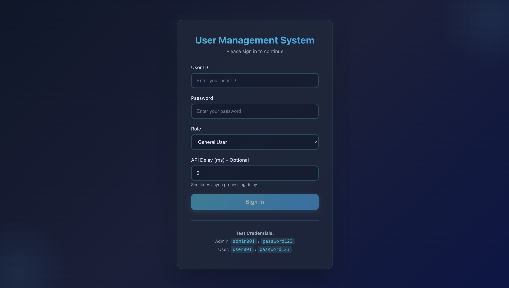
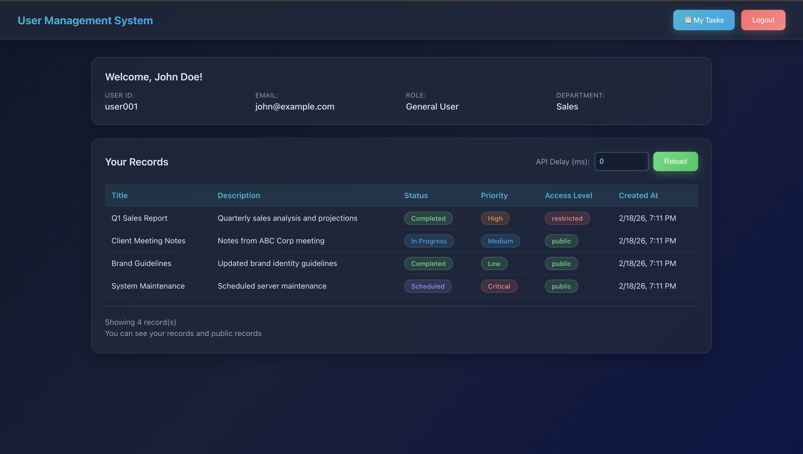
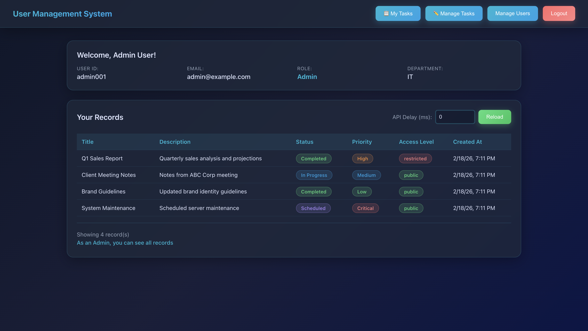

# User Management System

A full-stack application built with Angular 12+ and Node.js/TypeScript with MongoDB for user management and role-based access control.

## Features

### Authentication & Authorization
- Login page with User ID, Password, and Role selection
- JWT-based authentication
- Role-based access control (Admin & General User)
- Protected routes with Auth Guard

### Dashboard
- User profile display
- Records table with role-based data filtering
- Configurable API delay to demonstrate async processing
- Real-time loading states

### Admin Panel (Admin Only)
- User management (CRUD operations)
- View all users in the system
- Create, edit, and delete users
- Configurable API delay for async demonstration

### Technical Highlights
- **Modular Architecture**: Clean separation of concerns with core, shared, and feature modules
- **Services**: Centralized AuthService, UserService, and RecordService
- **HTTP Interceptor**: Automatic JWT token injection
- **Guards**: Route protection based on authentication and roles
- **Async Processing**: Configurable API delays to showcase async handling
- **Responsive UI**: Modern, clean design with SCSS

## Screenshots

All screenshots should be placed in the `screenshots/` folder and referenced below:

### Login Page

*Secure authentication with User ID, Password, and Role selection*

### User Dashboard

*View user profile and personal records with real-time filtering*

### User Tasks Management

*Users can view assigned tasks and update their status*

### Admin Panel - User Management

*Complete user management system with CRUD operations*

### Admin Panel - Task Management

*Admins can create, assign, and manage tasks for users*

### Modern Dark Theme
The application features a professional **dark theme** with:
- Cyan/teal gradient accents (`#06b6d4` to `#0ea5e9`)
- Glassmorphism effects on cards and modals
- Smooth hover animations and transitions
- Responsive design that works on all devices

## Tech Stack

### Backend
- Node.js with TypeScript
- Express.js
- MongoDB with Mongoose
- JWT for authentication
- bcryptjs for password hashing

### Frontend
- Angular 12+
- TypeScript
- SCSS for styling
- Reactive Forms
- HttpClient with Interceptors
- RxJS for async operations

## Project Structure

```
ang_assignment/
├── backend/
│   ├── src/
│   │   ├── config/          # Database configuration
│   │   ├── controllers/     # Request handlers
│   │   │   ├── authController.ts
│   │   │   ├── userController.ts
│   │   │   ├── recordController.ts
│   │   │   └── taskController.ts       # Task management logic
│   │   ├── middleware/      # Auth middleware
│   │   ├── models/          # Mongoose models
│   │   │   ├── User.ts
│   │   │   ├── Record.ts
│   │   │   └── Task.ts                 # Task schema
│   │   ├── routes/          # API routes
│   │   │   ├── authRoutes.ts
│   │   │   ├── userRoutes.ts
│   │   │   ├── recordRoutes.ts
│   │   │   └── taskRoutes.ts           # Task endpoints
│   │   ├── utils/           # Utility functions
│   │   ├── server.ts        # Express server
│   │   └── seed.ts          # Database seeding with sample tasks
│   ├── dist/                # Compiled JavaScript
│   ├── package.json
│   └── tsconfig.json
│
└── frontend/
    ├── src/
    │   ├── app/
    │   │   ├── core/
    │   │   │   ├── guards/      # Auth guard
    │   │   │   ├── interceptors/ # HTTP interceptor
    │   │   │   └── services/
    │   │   │       ├── auth.service.ts
    │   │   │       ├── user.service.ts
    │   │   │       ├── record.service.ts
    │   │   │       └── task.service.ts # Task API calls
    │   │   ├── features/
    │   │   │   ├── login/           # Login component
    │   │   │   ├── dashboard/       # Dashboard component
    │   │   │   ├── admin/           # User management
    │   │   │   ├── user-tasks/      # User task view
    │   │   │   └── admin-tasks/     # Admin task management
    │   │   ├── shared/
    │   │   │   └── models/
    │   │   │       ├── user.model.ts
    │   │   │       ├── record.model.ts
    │   │   │       └── task.model.ts
    │   │   ├── app-routing.module.ts
    │   │   └── app.module.ts
    │   └── environments/
    ├── dist/                # Build output
    ├── package.json
    ├── angular.json
    └── proxy.conf.json     # API proxy configuration

├── screenshots/            # Application screenshots
├── README.md              # Main project documentation
└── setup.sh               # Setup script
```

## Setup Instructions

### Prerequisites
- Node.js (v14 or higher)
- MongoDB (running locally or connection string)
- npm or yarn

### Backend Setup

1. Navigate to backend directory:
```bash
cd backend
```

2. Install dependencies:
```bash
npm install
```

3. Configure environment variables (`.env` file already created):
```
PORT=3000
MONGODB_URI=mongodb://localhost:27017/user_management
JWT_SECRET=your_jwt_secret_key_change_in_production
NODE_ENV=development
```

4. Start MongoDB (if running locally):
```bash
mongod
```

5. Seed the database with dummy data:
```bash
npm run seed
```

6. Start the backend server:
```bash
npm run dev
```

Backend will run on `http://localhost:3000`

### Frontend Setup

1. Navigate to frontend directory:
```bash
cd frontend
```

2. Install dependencies:
```bash
npm install
```

3. Start the Angular development server:
```bash
ng serve
```

Frontend will run on `http://localhost:4200`

## Test Credentials

After seeding the database, use these credentials:

### Admin User
- **User ID**: `admin001`
- **Password**: `password123`
- **Role**: Admin

### General Users
- **User ID**: `user001`
- **Password**: `password123`
- **Role**: General User

- **User ID**: `user002`
- **Password**: `password123`
- **Role**: General User

## API Endpoints

### Authentication
- `POST /api/auth/login` - User login

### Users (Admin only)
- `GET /api/users?delay=<ms>` - Get all users
- `POST /api/users` - Create new user
- `PUT /api/users/:id` - Update user
- `DELETE /api/users/:id` - Delete user

### Records
- `GET /api/records?delay=<ms>` - Get records (filtered by role)

### Tasks
- `GET /api/tasks?delay=<ms>` - Get tasks (admins see all, users see their assigned tasks)
- `POST /api/tasks` - Create new task (Admin only)
- `PATCH /api/tasks/:taskId/status` - Update task status (Users can update their own tasks)
- `PATCH /api/tasks/:taskId` - Edit task details (Admin only)
- `DELETE /api/tasks/:taskId` - Delete task (Admin only)

## Features Demonstration

### 1. Role-Based Access Control
- Login as `admin001` to access admin panel
- Login as `user001` to see restricted dashboard access
- Admin can see all records, users see only their records + public records

### 2. Async Processing with Delay
- On login page, set "API Delay" to simulate slow network (e.g., 2000ms)
- On dashboard, use delay control to see loading states
- On admin panel, test delay with user management operations

### 3. User Management (Admin)
- Create new users with different roles
- Edit existing user information
- Delete users from the system
- All operations reflect immediately in the UI

### 4. Task Management System
#### For Users:
- View all tasks assigned to them
- Update task status (Not Started → In Progress → Completed → On Hold)
- Monitor task priorities and due dates
- Real-time task list updates

#### For Admins:
- Create new tasks and assign to specific users
- Edit task details (title, description, priority, assignee, due date)
- Delete tasks from the system
- View all tasks across all users
- Monitor task progress and completion

### 5. Clean Architecture
- Services are injected and reusable
- Guards protect routes automatically
- Interceptors handle authentication seamlessly
- Modular component structure
- Separation of concerns across layers

## Development Notes

### Backend
- TypeScript for type safety
- Async/await for clean async code
- Middleware for authentication and authorization
- Configurable delay parameter for testing async behavior

### Frontend
- Reactive forms for validation
- Services for business logic separation
- Guards for route protection
- Interceptors for global HTTP configuration
- SCSS for maintainable styling
- RxJS observables for async operations

## Production Build

### Backend
```bash
cd backend
npm run build
npm start
```

### Frontend
```bash
cd frontend
ng build --prod
```

Build artifacts will be in `frontend/dist/`

## License

This project is created for evaluation purposes.
